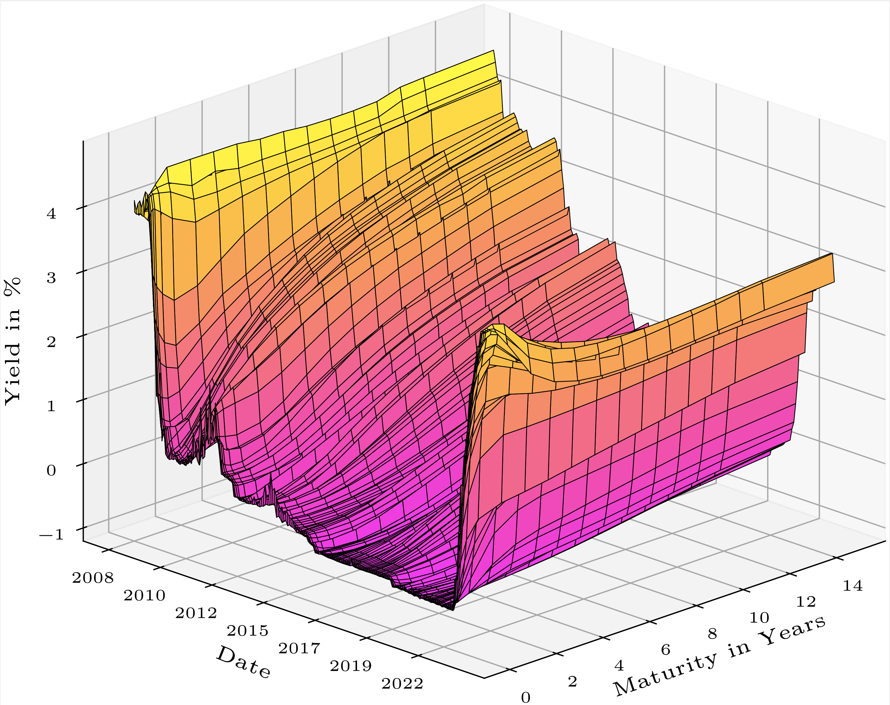

# master-thesis
Master Thesis on comparing various state-of-the-art Dynamic Nelson Siegel methods.
I investigate models to fit the term-structure derived from Euro-market data and compare them along in-sample-fit, out-of-sample-fit (i.e. forecasting accuracy) as well as robustness.
Models considered include:
- Dynamic Nelson Siegel (DNS)
- Dynamic Nelson Siegel with time-varying shape(=loading) parameter (DNS-TVS)
- Dynamic Nelson Siegel with time-varying common volatility parameter (DNS-TVV)
- Dynamic Nelson Siegel with time-varying shape- and volatility parameter (DNS-TVSV)
- Arbitrage Free Dynamic Nelson Siegel (AFDNS)

The data:

12-step Ahead Forecasts of all five models and Random Walk for six time periods:

